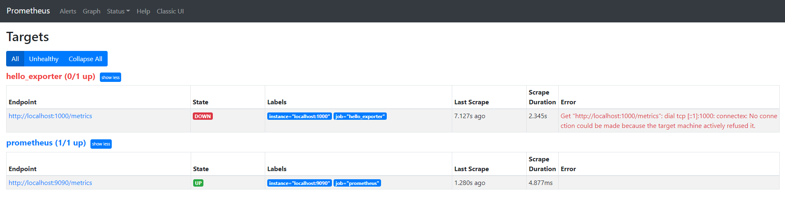

# Prometheus and NodeJS Application

# Table of contents

1. [Introduction](#i-introduction)
2. [Installation](#ii-installation)
3. [Steps of monitoring](#iii-steps-of-monitoring)
   1. [Import Prometheus client for NodeJS](#1-import-prometheus-client-for-nodejs)
   2. [Implement metrics in project](#2-implement-metrics-in-project)
   3. [Create exporter for project](#3-create-exporter-for-project)
4. [Project Launch](#iv-project-launch)
5. [To go further](#v-to-go-further)

## I. Introduction

This project is a simple example of using Prometheus Metrics with NodeJS Application
for monitoring.  
I present how we can implement metrics in a NodeJS project and using Prometheus
to collect and analyze these metrics in Prometheus Data Base.

## II. Installation

To use this project (or made monitoring with Prometheus and NodeJS Application), you must install :  
- NodeJS (any version) : https://nodejs.org/en/
- Prometheus : https://prometheus.io/download/  
  
To go further in monitoring :  
  
- Alertmanager : https://prometheus.io/download/
- Grafana : https://grafana.com/grafana/download?pg=get&plcmt=selfmanaged-box1-cta1

## III. Steps of monitoring

This section present steps of setting up monitoring of an application. Here, we
will use NodeJS Language, but these steps can be repeated for any language with Prometheus Client.

### 1. Import Prometheus client for NodeJS

In **package.json**, we add _"prom-client": "^13.1.0"_. With this information, when
you use `npm install`, npm know that **prom-client**, the Prometheus client, must be installed
with the others NodeJS modules indicated.
You can find the GitHub repository of prom-client here : https://github.com/siimon/prom-client   

`npm install` create a **node_modules** directory at the root of the project. If you go
in this directory, you can see an others directories including **prom-client**.  

In your file, you can add :  
~~~~
const {Counter, register} = require("prom-client");
~~~~
Thus, we import **Counter** and **register** objects of NodeJS client for Prometheus.  
**register** is the object containing all metrics initialized.

### 2. Implement metrics in project

**prom-client** give access to several Javascript Objects representing the different
types of Prometheus metrics : Counter, Gauge, Summary and Histogram.
According to your needs, you can choose one (or more) of these metrics and using in your project.  

Here, I wish count the number of requests to the web page corresponding to a mini-server. So, in
**Hello.ts** file, I create a server with NodeJS module **restify** like this :

~~~~
const restify = require("restify");
~~~~

And : 

~~~~
const server = restify.createServer(); // Server creation
~~~~

After this, you can initialize your(s) metric(s) respecting the architecture of the NodeJS client
(and most of Prometheus Client).

~~~~
// Creation of Counter metric
const nb_request_total = new Counter({
    name: "nb_request_total",
    help: "Number of req"
});
~~~~
For Prometheus metrics, you can respect different rules of **name** : https://prometheus.io/docs/practices/naming/  
For example, with a Counter metrics, the name ends with _\_total_.  
**help** indicate the usefulness of the metric.

When the metric is initialized, you can use it in your project with the
functions offerts by the Prometheus client like this :
~~~~
// Definition of the main route localhost:1000
server.get("/", async (req, res) =>{
    nb_request_total.inc(); // incrementation of the metric
   try{
       res.send("Hello World !!"); // Send a message on the main route
   } catch(err){
       console.log(err);
   }
});
~~~~

Here, I indicate the main route will receive "Hello World" as information. But
the second line increment our metric ( inc() default : +1), whenever a request on the main route is made.

### 3. Create exporter for project

So that Prometheus can retrieve metrics from our application, it's necessary to expose the metrics
with an **exporter**. An exporter is a mini-server who will receive the metrics contained in the **register**
objet.  
However, this application is already a server. So, we can just add a new route _/metrics_ to
expose our metrics :

~~~~
// Definition of the localhost:1000/metrics route who will receive the metric(s)
server.get("/metrics", async (req, res) => {
   try{
       res.sendRaw(await register.metrics()); // send metric(s) to the localhost:1000/metrics route
   } catch(err){
       console.log(err);
   }
});
~~~~

Here, I indicate the metrics root will receive the metrics contained in the register object of the Prometheus client.

## IV. Project Launch

- Clone this project
  

- Edit configuration's file prometheus.yml with 
~~~~
# my global config
global:
  scrape_interval:     15s # Set the scrape interval to every 15 seconds. Default is every 1 minute.
  evaluation_interval: 15s # Evaluate rules every 15 seconds. The default is every 1 minute.
  # scrape_timeout is set to the global default (10s).

# Alertmanager configuration
alerting:
  alertmanagers:
  - static_configs:
    - targets:
      # - alertmanager:9093

# Load rules once and periodically evaluate them according to the global 'evaluation_interval'.
rule_files:
  # - "first_rules.yml"
  # - "second_rules.yml"

# A scrape configuration containing exactly one endpoint to scrape:
# Here it's Prometheus itself.
scrape_configs:
  # The job name is added as a label `job=<job_name>` to any timeseries scraped from this config.
  - job_name: 'prometheus'

    # metrics_path defaults to '/metrics'
    # scheme defaults to 'http'.

    static_configs:
      - targets: ['localhost:9090']

  - job_name: 'hello_exporter'

    static_configs:
      - targets: ['localhost:1000']
~~~~

- Go to http://localhost:9090, Prometheus link and Status/Targets, you can see this :

  

- In console, use `node Hello.ts` for launch program and see Prometheus Target :
  hello_exporter must be active and you can, in Prometheus main page, use a request with the name of your metric.
  
  
- Play with http://localhost:1000 and http://localhost:1000/metrics (or Prometheus) to look metric's evolution

## V. To go further

You can configure Prometheus with rules files to generate alerts and send it to Alertmanager, who will manage them.  
Also, you can configure Grafana to listen Prometheus and create dashbords to analyze our metrics.